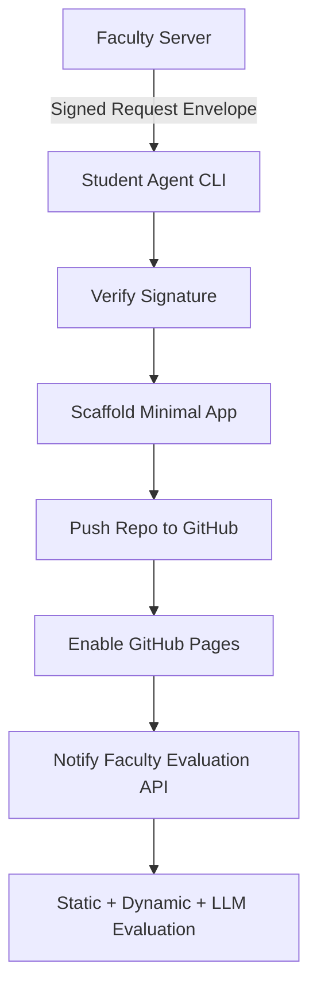

# 🧠 LLM Code Deployment

> A secure, automated system that lets students deploy code for **deterministic, LLM-based evaluation** through a reproducible CLI and signed request envelopes.


---

## 🚀 Overview

**LLM Code Deployment** is a deterministic and tamper-evident delivery pipeline designed for academic use.  
It ensures that every student submission is **securely verified, reproducible, and auto-evaluable** using CLI automation, GitHub Actions, and LLM-based evaluation pipelines.

Developed as part of a **Diploma Project (Deadline — 10 Oct 2025)**, it demonstrates an **end-to-end reproducible deployment and evaluation system** for student assignments.

---

## 💡 Key Features

- **🔐 Signed Request Envelope (SRE) Verification** — every assignment request is cryptographically signed to prevent tampering.  
- **💻 Student Agent CLI** — one command to accept, scaffold, deploy, and notify results.  
- **⚙️ Deterministic Deployment** — auto-generates a minimal app and publishes it publicly to GitHub Pages.  
- **🧾 Faculty Evaluation API** — runs static scans, dynamic browser tests, and LLM rubric checks.  
- **📡 Exponential Backoff Notifications** — ensures callback delivery to the evaluation server.  
- **📂 MIT-Licensed Repos** — open and reproducible student submissions for transparency.

---

## 🧩 System Architecture



---

## ⚙️ Components

### 1️⃣ Student Agent CLI
A Python-based command-line tool that:
- Accepts a **Signed Request Envelope (SRE)** JSON  
- Verifies authenticity using **Ed25519 signatures**  
- Scaffolds and deploys a student project  
- Automates repo creation and GitHub Pages enablement  

### 2️⃣ Faculty Evaluation Server
A **FastAPI** backend that:
- Receives notifications from student deployments  
- Runs:
  - ✅ **Static Checks** — linting / secret scan  
  - 🧪 **Dynamic Checks** — browser tests via Playwright  
  - 🤖 **LLM Rubric Evaluation** — semantic quality scoring  
- Sends a **Round-2 SRE** for adaptive evaluation if required  

---

## 🧰 Tech Stack

| Layer | Technology |
|-------|-------------|
| **Backend** | FastAPI |
| **CLI** | Python (Typer / Click) |
| **Evaluation** | Playwright + LLM APIs |
| **Version Control** | GitHub REST API |
| **Testing** | Pytest |
| **Automation** | GitHub Actions |
| **Security** | Ed25519 / JWS (JSON Web Signature) |
| **Deployment** | GitHub Pages + uv (Python Env Manager) |

---

## 🧾 Example Signed Request Envelope (SRE)

```json
{
  "email": "student@institute.edu",
  "secret": "SRE_SECRET_KEY",
  "task": "weather_app",
  "round": 1,
  "nonce": "ae23b12",
  "brief": "Create a Flask app showing live weather using an API",
  "checks": ["static", "dynamic", "llm"],
  "evaluation_url": "https://faculty-server/api/notify",
  "attachments": []
}
```

---

## 💻 CLI Usage

```bash
# Clone the repo
git clone https://github.com/your-username/llm-code-deploy.git
cd llm-code-deploy

# Sync dependencies
uv sync

# Run local tests
uv run pytest

# Start the FastAPI server
uv run uvicorn server.main:app --reload
```

**Example Output:**
```
✅ Verified SRE signature successfully
📁 Repository created: https://github.com/student/weather_app
🌐 GitHub Pages deployed at: https://student.github.io/weather_app/
📤 Notification sent to evaluation server
```

---

## 🧠 Evaluation Workflow

| Stage | Actor | Description |
|--------|--------|-------------|
| 1️⃣ Round 1 | Student Agent | Builds repo + deploys app |
| 2️⃣ Faculty Check | Evaluation Server | Runs automated tests |
| 3️⃣ Round 2 | Faculty → Student | Sends adaptive task (optional) |
| 4️⃣ Result | System | Aggregates static, dynamic & LLM results |

---

## 👩‍💻 Developer Setup

```bash
# Clone the repo
git clone https://github.com/your-username/llm-code-deploy.git
cd llm-code-deploy

# Sync dependencies
uv sync

# Run local tests
uv run pytest

# Start the FastAPI server
uv run uvicorn server.main:app --reload
```

---

## 📁 Project Structure

```
llm-code-deploy/
├── server/
│   ├── main.py
│   ├── routes/
│   ├── models/
│   └── utils/
├── student_agent/
│   ├── cli.py
│   ├── utils/
│   └── templates/
├── tests/
│   ├── test_cli.py
│   └── test_server.py
├── docs/
│   ├── architecture.md
│   └── report.pdf
├── .github/workflows/
│   ├── test.yml
│   └── deploy.yml
├── Makefile
├── README.md
└── LICENSE
```

---

## 🧪 Sample Evaluation Report

| Check Type | Status | Remarks |
|-------------|--------|----------|
| Static | ✅ Passed | No secrets or warnings |
| Dynamic | ✅ Passed | All Playwright tests succeeded |
| LLM Rubric | 🟩 8.5 / 10 | Code is clean and documented |

---

## 🔒 Security Principles

- **Tamper-Evident:** All SREs are cryptographically signed.  
- **Deterministic Builds:** Rebuilding yields identical repos.  
- **Transparent:** Public MIT repos for all students.  
- **Traceable:** Each task linked to nonce and commit SHA.  

---

## 🧾 Example GitHub Workflow (deploy.yml)

```yaml
name: Auto Deploy

on:
  push:
    branches: [ main ]

jobs:
  deploy:
    runs-on: ubuntu-latest
    steps:
      - uses: actions/checkout@v4
      - name: Setup Python
        uses: actions/setup-python@v5
        with:
          python-version: 3.11
      - name: Install dependencies
        run: pip install -r requirements.txt
      - name: Build and Deploy to Pages
        run: |
          python build.py
          echo "Deployed at $(date)"
```

---

## 🧭 Evaluation Rounds in Action

1️⃣ **Round 1 (Student)** — CLI verifies, scaffolds and deploys the app.  
2️⃣ **Round 2 (Faculty)** — Server issues follow-up SRE for refinement.  
3️⃣ **Final Submission** — CLI re-deploys and sends final notification.

---

## 📊 Timeline Summary

| Phase | Dates | Deliverables |
|-------|--------|--------------|
| Repo Initialization | 21 Sept | MIT License, Makefile, README |
| SRE + CLI Module | 25–27 Sept | `accept`, `scaffold` commands |
| GitHub Automation | 28–30 Sept | Pages + Notify Pipeline |
| Round-2 Flow | 1–2 Oct | Evaluation Integration |
| Dry Runs + Docs | 3–6 Oct | Report Draft & Demo |
| Submission | 10 Oct | Final Repo + Pages + Report |

---

## 👨‍🏫 Author

**Sarbajit Kumar De**  
🎓 Final Year | CSE  
📧 `sarbajit.dev@outlook.com`  
🌐 https://github.com/SarbajitDe

---

## 🪪 License

This project is licensed under the MIT License.

---

## 📚 References

- FastAPI Documentation  
- GitHub REST API v3  
- Playwright Testing  
- JOSE / JSON Web Signature (RFC 7515)

---

> _“Every student deployment should be deterministic, verifiable, and evaluable — that’s what this project ensures.”_ ✨
